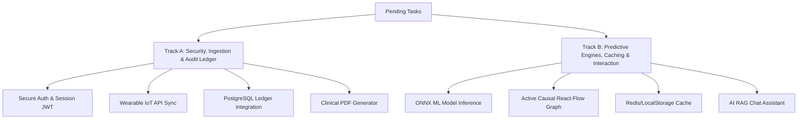

# VitalPredict (HealthSphere) Project Progress & Task Matrix

This document provides a comprehensive audit of the current progress of the VitalPredict health prediction system, identifies the pending engineering tasks, and divides them into two balanced, full-stack vertical development tracks.

---

## 1. Project Overview & Current Progress

VitalPredict is an explainable clinical decision support dashboard that calculates overall health scores, heart risk, and diabetes risk based on patient vitals and lifestyle habits. It features a what-if simulator and visualizes ML attribution weights (SHAP/LIME) and causal pathways.

### Completed Features

#### Core UI & Navigation System
* **Client-Side SPA Routing:** Fully implemented routes for Dashboard, Input, Simulator, Architecture, Recommendations, Timeline, Consultation Brief, and Profile in [App.tsx](file:///c:/Users/Admin/OneDrive/Documents/VitalPredict/src/App.tsx).
* **Theme System:** Dark/Light mode reactivity syncing dynamically with the DOM in [AppContext.tsx](file:///c:/Users/Admin/OneDrive/Documents/VitalPredict/src/context/AppContext.tsx).
* **Multi-Language Support:** Translation dictionary setup for internationalization support in [translations.ts](file:///c:/Users/Admin/OneDrive/Documents/VitalPredict/src/data/translations.ts).

#### Analytical Dashboards & Simulation
* **Key Metrics Visuals:** Overall health meter, dynamic heart risk, diabetes risk gauge, sleep quality index, and stress charts in [Dashboard.tsx](file:///c:/Users/Admin/OneDrive/Documents/VitalPredict/src/pages/Dashboard.tsx).
* **Recharts Integration:** Trend chart illustrating history logs for sleep, heart rate, and steps.
* **Health Input Form:** Multi-parameter forms to override and update default patient vitals in [HealthInput.tsx](file:///c:/Users/Admin/OneDrive/Documents/VitalPredict/src/pages/HealthInput.tsx).
* **What-If Counterfactual Simulator:** Dynamic sliders showing simulated health drops/improvements with explanations in [Simulation.tsx](file:///c:/Users/Admin/OneDrive/Documents/VitalPredict/src/pages/Simulation.tsx).

#### Services & Simulated Backend
* **Data Ingestion Engine:** Parser for incoming wearable, EMR, lab, and nutrition JSON variables inside [architectureService.ts](file:///c:/Users/Admin/OneDrive/Documents/VitalPredict/src/services/architectureService.ts).
* **Explainable AI (XAI) Computations:** Dynamic SHAP (Game-Theoretic attributions) and LIME mock contribution matrices mapping out risk triggers.
* **Causal Graph & Neo4j Models:** Interactive React Flow graph displaying causal pathways and node details in [HealthGraph.tsx](file:///c:/Users/Admin/OneDrive/Documents/VitalPredict/src/pages/HealthGraph.tsx).
* **Evolutionary Health Passport Ledger:** Version-controlled blocks recording patient state snapshots with cryptographic hashes.
* **Redis & PostgreSQL Consoles:** Simulated execution log visualizers for PostgreSQL schemas and Redis caching in the pipeline view.

---

## 2. Pending Works

To move from a prototype to a production-ready medical platform, the following features are pending implementation:

1. **Secure Authentication & Access Controls:** Replace the mock login bypass with token-based authentication (JWT), secure HTTP-only cookies, password hashing, and user registration.
2. **Real Database Integration:** Replace in-memory mock datasets and arrays (PostgreSQL query lists, Neo4j graphs, Redis cache logs) with actual database database integrations.
3. **True Machine Learning Model Inference:** Replace hardcoded algebraic risk scoring formulas with an inference engine loading trained Python XGBoost/Random Forest models (via local ONNX Web Runtime or backend API endpoints).
4. **Active Wearable Sync:** Connect the data ingestion pipeline to live external APIs (Apple HealthKit, Google Fit, or Fitbit API) instead of text-based JSON inputs.
5. **PDF Report Exports:** Upgrade the plain-text clinical brief download to a styled PDF file containing digital signature lines for consulting doctors.
6. **Patient AI Assistant:** RAG-based conversational chat interface allowing patients to ask natural language questions about their risk scores and guidelines before their physician appointment.

---

## 3. Equal Task Allocation (Full-Stack Vertical Slices)

To ensure that both contributors make substantial contributions to the code across frontend, logic, database, and algorithm layers, the remaining work is divided into two vertical feature domains.

### Track A: Security, Ingestion & Audit Ledger (Developer 1)
*Focuses on security, external data ingestion, ledger verification, and clinical document assembly.*

| Module | Technical Details | Deliverables |
| :--- | :--- | :--- |
| **1. Authentication & Security** | Implement JWT-based session security. | • Login/Register page UI updates. • Secure HTTP-only token exchange. • Route-guard middleware for client side. |
| **2. Wearable IoT Ingestion** | Connect the pipeline to external health platforms. | • Oauth2 consent page for wearable syncing. • API client scripts connecting to Fitbit/Google Fit REST services. • Ingestion sync logger and status indicators. |
| **3. Immutable Audit Ledger** | Persist Evolutionary Health Passport snapshots. | • Connect blockchain-like blocks to PostgreSQL tables. • Cryptographic SHA-256 verification functions run on write. • Patient Ledger review page with tamper checks. |
| **4. PDF Brief Generation** | Create high-fidelity exports for consultations. | • Integrate PDF generator library (e.g. `jsPDF`). • Print-optimized clinical reports with logo and signature pads. • One-click export options on the Consultation Brief page. |

---

### Track B: Predictive Engines, Caching & Interaction (Developer 2)
*Focuses on machine learning models, caching optimizations, visual pathways, and conversational AI helper modules.*

| Module | Technical Details | Deliverables |
| :--- | :--- | :--- |
| **1. Machine Learning Integration** | Hook up actual XGBoost/Random Forest model files. | • ONNX Web Runtime scripts to load model files locally. • Replace mathematical formulas with multi-variable model inference. • Interactive SHAP/LIME charts updating based on model runs. |
| **2. Causal React-Flow Graph** | Build out the biological pathway network. | • Expand React Flow edges to update weight colors dynamically. • Expand node details drawer with medical literature definitions. • Add node search and filtering tools for complex pathways. |
| **3. Redis Cache Integration** | Connect database caching layer to minimize model loads. | • Set up a caching manager for SHAP calculations (LocalStorage/Redis). • Caching hit/miss status dashboard showing speed statistics. • Cache invalidation logic running whenever health details update. |
| **4. AI RAG Chat Assistant** | Build conversational helper for patients. | • Integration of lightweight LLM chat drawer component. • RAG scripts to ingest patient profile data as prompt context. • Automated doctor-question prep helper. |

---

## 4. Local Deployment & Docker Instructions

To simplify deployment and setup for both developers, the workspace has been containerized.

### Docker Commands
* **Build image:** `docker build -t vitalpredict .`
* **Run container (detached on port 80):** `docker run -d -p 80:80 --name vitalpredict-app vitalpredict`
* **Stop container:** `docker stop vitalpredict-app`
* **Restart container:** `docker restart vitalpredict-app`

### Using Docker Compose
* **Start Application:** `docker compose up -d`
* **Build & Start:** `docker compose up -d --build`
* **Stop & Remove Containers:** `docker compose down`
* **Check Logs:** `docker compose logs -f`
